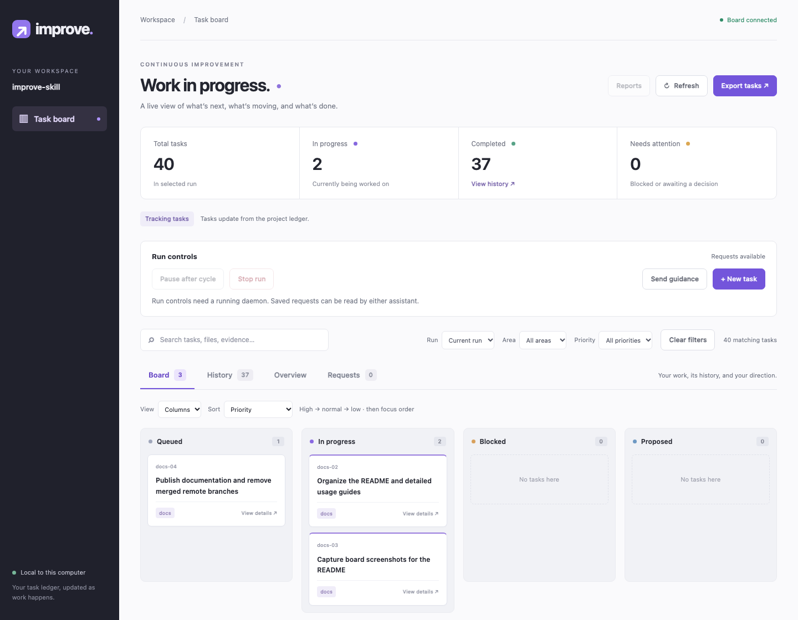
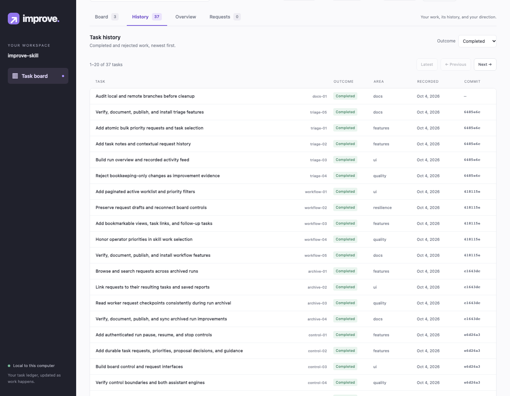
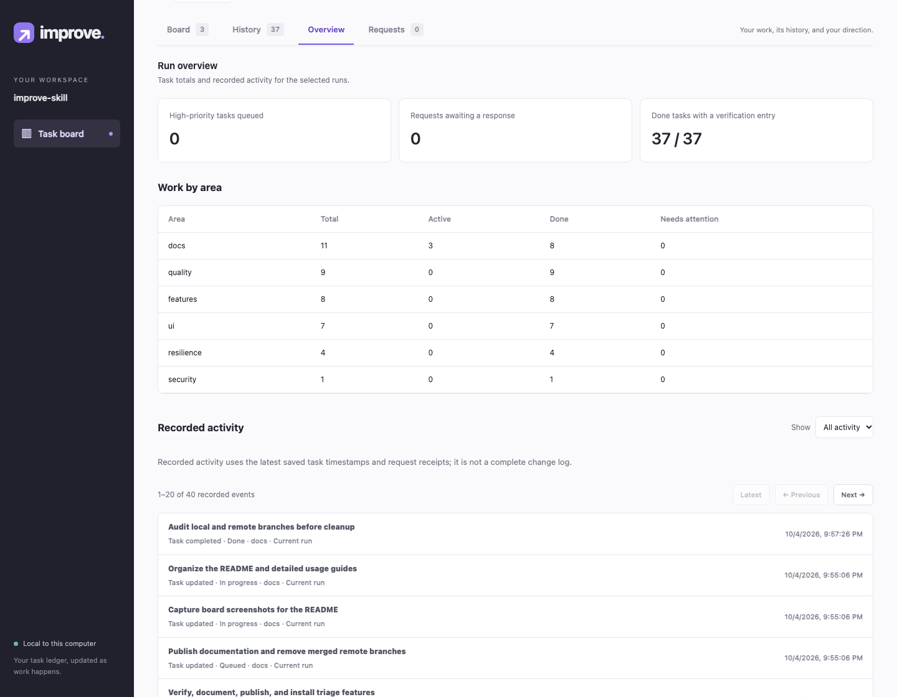

# /improve

Continuous, verified codebase improvements for **Codex and Claude Code**, with a local
board for tracking work and steering the run.

Tell the skill how long to work. It asks ten questions about your priorities, builds a
backlog, implements and checks improvements, and keeps discovering useful work until the
deadline. Features, UI, graphics/assets, performance, bugs, security, and code quality can
all be part of the focus.

```text
Codex:       $improve 4h
Claude Code: /improve 90m ~/Code/api
```

[Quick start](#quick-start) · [Board & screenshots](#local-board) ·
[Background runs](#background-runs) · [How it works](#how-it-works) ·
[Improve-max](#improve-max) · [Documentation](#documentation)

| Capability            | What you get                                                                       |
| --------------------- | ---------------------------------------------------------------------------------- |
| Your priorities first | Ten intake questions and an ordered focus plan before the timer starts             |
| Continuous discovery  | An empty backlog triggers another investigation, not an early finish               |
| Verified changes      | Evidence, acceptance checks, and relevant tests before work is marked done         |
| Local control         | Task requests, notes, priorities, proposal decisions, and daemon pause/resume/stop |
| Durable recovery      | Saved deadlines, checkpoints, requests, and reports across restarts                |
| Either assistant      | Background work uses the originating or explicitly selected Codex/Claude engine    |

## Quick start

### 1. Install

Requires **Git and Python 3.9+** on macOS/Linux. Background runs also require the selected
assistant's authenticated CLI. The board needs no npm setup or hosted account.

For a fresh installation, clone once and link both skills into each assistant:

```sh
improve_checkout="$HOME/Code/improve-skill"
git clone https://github.com/kshaham/improve-skill.git "$improve_checkout"

for improve_skills_dir in "$HOME/.claude/skills" "$HOME/.agents/skills"; do
  mkdir -p "$improve_skills_dir"
  for improve_name in improve improve-max; do
    improve_target="$improve_checkout"
    if [ "$improve_name" = improve-max ]; then improve_target="$improve_checkout/max"; fi
    if [ -e "$improve_skills_dir/$improve_name" ] || [ -L "$improve_skills_dir/$improve_name" ]; then
      printf 'Keeping existing installation: %s\n' "$improve_skills_dir/$improve_name"
    else
      ln -s "$improve_target" "$improve_skills_dir/$improve_name"
    fi
  done
done
```

Existing `~/.codex/skills` installations also work with the tested Codex CLI 0.160.0.
Keep an existing installation in its current root to avoid duplicate skills. The commands
preserve existing directories and links, including broken links. `improve-max` depends on
the parent checkout's shared scripts and references.

### 2. Choose a duration and answer the intake

Open your target repository in either assistant and invoke the skill:

```text
$improve 4h
/improve 90m ~/Code/api
```

Duration is required; the repository defaults to the current directory. The ten questions
cover outcomes, features, UI, assets, performance, bugs, security, supporting quality,
constraints, and success criteria. Answer them together if you prefer; “none” and “use
your judgment” are valid answers. The timer starts after the intake. Resumed cycles reuse
your answers and original deadline.

See the [exact intake questions](references/intake.md) and
[priority and verification guide](docs/workflow.md).

### 3. Follow the work

The skill shares a verified local board URL when the run starts. Open it to inspect tasks,
submit direction, read responses, and review completed work. Changes are recorded in the
target repository's `.improve/` directory, which should stay out of version control.

### Updating

For the linked installation above, update the shared checkout:

```sh
git -C "$HOME/Code/improve-skill" pull --ff-only
```

For copied installations, sync the same revision into both existing skill directories and
preserve executable permissions on `scripts/*.sh`. Reload the assistant if needed.

## Local board

The board serves on `127.0.0.1`, uses local assets, and stays available after the improvement
run ends. It reads recorded tasks directly, including `improve-max` experiments and archived
runs. No separate task database or model calls are needed to browse it.

### Work in progress

Use four working columns or a compact worklist. Sort and filter by priority, select up to
50 unfinished current tasks for a bulk priority request, or open a task to inspect its
evidence, add a note, create follow-up work, or decide a proposal.



### Completed history

Completed and rejected work moves into a searchable list, with twenty rows per page.
Task details retain verification and commits. New results preserve your place while you
browse older pages; exports include every matching page.



### Run overview

Compare work by area, see queued priorities and pending requests, and browse recorded
task activity and request responses. Click an event to open the associated work or export
the overview as JSON.



These screenshots show this repository's actual local board, captured while updating these
docs. [Capture details](docs/screenshots/README.md). Recorded verification means an entry
exists; the board does not independently certify its result. Activity uses saved timestamps
and request receipts, so it is not a complete audit log.

### Steer a run from the browser

| Action                               | Behavior                                                                          |
| ------------------------------------ | --------------------------------------------------------------------------------- |
| New task or guidance                 | Save desired outcomes, acceptance checks, or a change in focus                    |
| Priority, note, or proposal decision | Send direction tied to a current task; notes can annotate finished work           |
| Requests                             | Browse pending/applied/declined responses and links to resulting work across runs |
| Pause / resume / stop                | Control a live daemon at checkpoints; pause keeps the original deadline           |
| Drafts and bookmarks                 | Recover unfinished forms and reopen a view or exact task                          |
| Reports and exports                  | Read saved reports and download matching tasks, requests, or overview data        |

Requests are applied by the skill at a checkpoint. **Applied** means the plan or ledger
was updated; task verification determines **Done**. The board does not launch an agent or
change its engine. Run controls require a running daemon; foreground sessions consume the
same saved task requests.

To open a board manually for a repository with an improvement ledger:

```sh
improve_board="$HOME/Code/improve-skill/scripts/improve-board.sh"
improve_repo="$HOME/Code/my-app"
"$improve_board" --repo "$improve_repo" --start
"$improve_board" --repo "$improve_repo" --status --json
"$improve_board" --repo "$improve_repo" --stop
```

Use the URL printed by `--start`; the preferred port is 8765, with a free-port fallback.
Stopping the board does not stop the improvement run. See the [board guide](docs/board.md)
for filters, drafts, request handling, ports, and service lifecycle.

## Background runs

Complete the interactive intake first. The skill passes `--engine codex` or `--engine claude`
according to its host; a resumed run keeps its saved engine, model, and deadline.

```sh
improve_daemon="$HOME/Code/improve-skill/scripts/improve-daemon.sh"
improve_repo="$HOME/Code/api"

# Launch a Codex run using answers already collected from the user.
"$improve_daemon" --engine codex --repo "$improve_repo" --for 6h \
  --intake /path/to/intake.json

# Inspect or stop the run from another terminal.
"$improve_daemon" --repo "$improve_repo" --status --json
"$improve_daemon" --repo "$improve_repo" --stop
```

Use `--engine claude` for Claude Code. The target repository must be clean at launch, and
the CLI must have the permissions needed for the authorized work. A provider is never
silently substituted when a CLI is missing.

The [runner guide](docs/running.md) covers detached launches, Codex sandbox settings,
account-limit backoff, `--resume`, report-only `--finalize`, `--new-run`, and troubleshooting.
The daemon cannot work while the machine is asleep or powered off.

## How it works

1. **Agree on outcomes.** Save the ten answers, priorities, exclusions, and authorization.
2. **Establish the baseline.** Start the clock, inspect the repository's gates, and create
   an improvement branch. Setup counts toward the requested duration.
3. **Discover and prioritize.** Find concrete gaps, refill the backlog, and rank eligible
   work by user priority, focus, and evidence-based importance.
4. **Implement and verify.** Settle one item at a time, keeping verified changes and
   recording rejected ideas with their evidence.
5. **Report and continue.** Save checkpoints and hourly reports, then keep finding work
   until the deadline. Empty queues and finished batches are not reasons to stop;
   status-only edits do not count as progress.

A stalled environment or explicit user stop can end a run early, with the actual reason
recorded. Only deadline expiry permits a normal completion. Reports remain honest about
work that could not be verified.

By default, `/improve` does not push changes, edit `main`, weaken tests, change dependencies
or schemas, or access secret files. Explicit user authorization is retained and honored
within its scope. Findings needing broader authority become proposals while eligible work
continues. See [workflow and boundaries](docs/workflow.md) for the full contract.

## Improve-max

Use [`improve-max`](max/SKILL.md) for measured transformations over days: subsystem rewrites,
framework changes, data layouts, or other larger bets. It adds characterization corpora,
spikes, kill criteria, and incremental delivery while sharing intake, state, and the board.

```text
Codex:       $improve-max 3d ~/Code/api --target 5x --kinds design,data
Claude Code: /improve-max 3d ~/Code/api --target 5x --kinds design,data
```

Targets are measured goals, not promises. Reaching them returns to ordinary improvement
until expiry unless `--stop-at-target` explicitly permits an early finish. Read the
[bet protocol](max/references/bets.md) and
[characterization guide](max/references/characterization.md) before using larger-change modes.

## Documentation

| Guide                                           | Read it for                                                       |
| ----------------------------------------------- | ----------------------------------------------------------------- |
| [Workflow](docs/workflow.md)                    | Intake, focus, discovery lanes, evidence, and boundaries          |
| [Local board](docs/board.md)                    | Views, requests, drafts, reports, exports, and service lifecycle  |
| [Runner and recovery](docs/running.md)          | Background execution, all CLI options, state, and troubleshooting |
| [Development](docs/development.md)              | Python/browser checks and optional CodeGraph indexing             |
| [Skill instructions](SKILL.md)                  | The full agent execution contract                                 |
| [Request protocol](references/board-control.md) | Checkpoint handling and idempotent acknowledgments                |
| [State schema](references/ledger.md)            | Durable run, task, and discovery records                          |

## Development

From the checkout:

```sh
python3 -B -m unittest discover -s tests -v
uv run --with playwright python tests/browser_board.py --chrome /path/to/chrome
```

Python tests use temporary repositories and fake Codex/Claude CLIs. Browser checks cover
large ledgers, controls, drafts, archives, batch requests, and responsive layouts. They do
not launch paid model runs. See [development and verification](docs/development.md) for
requirements and screenshot artifacts.

Licensed under [MIT](LICENSE).
